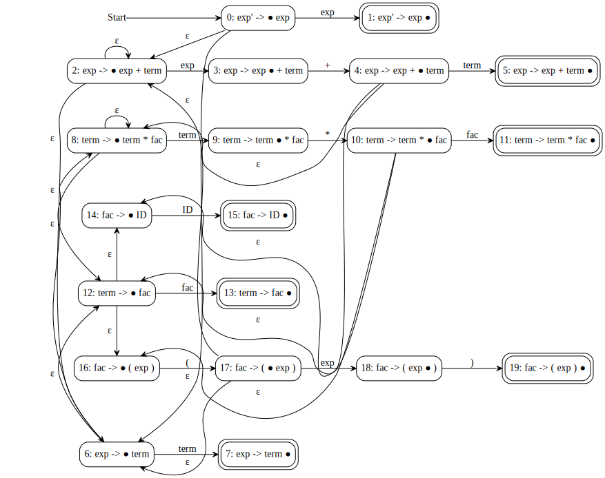
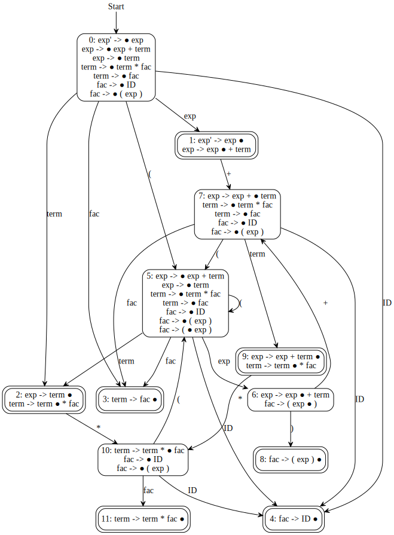
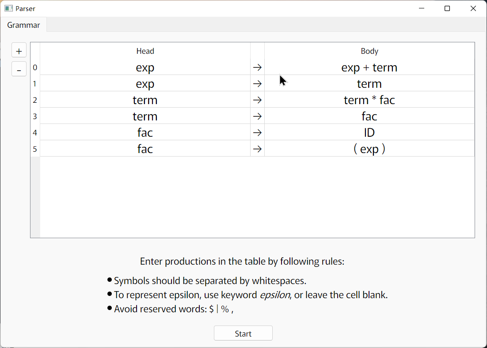
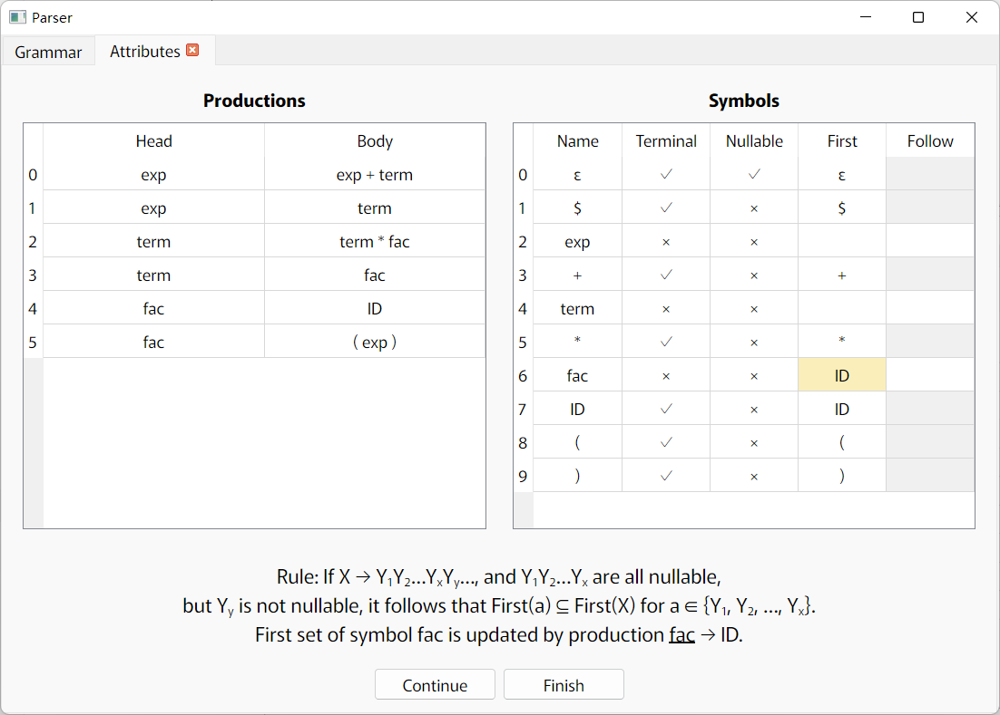
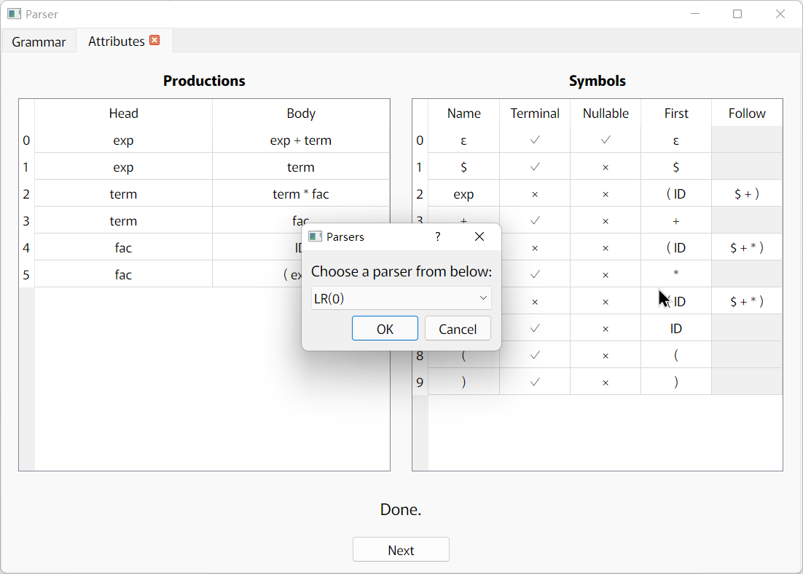
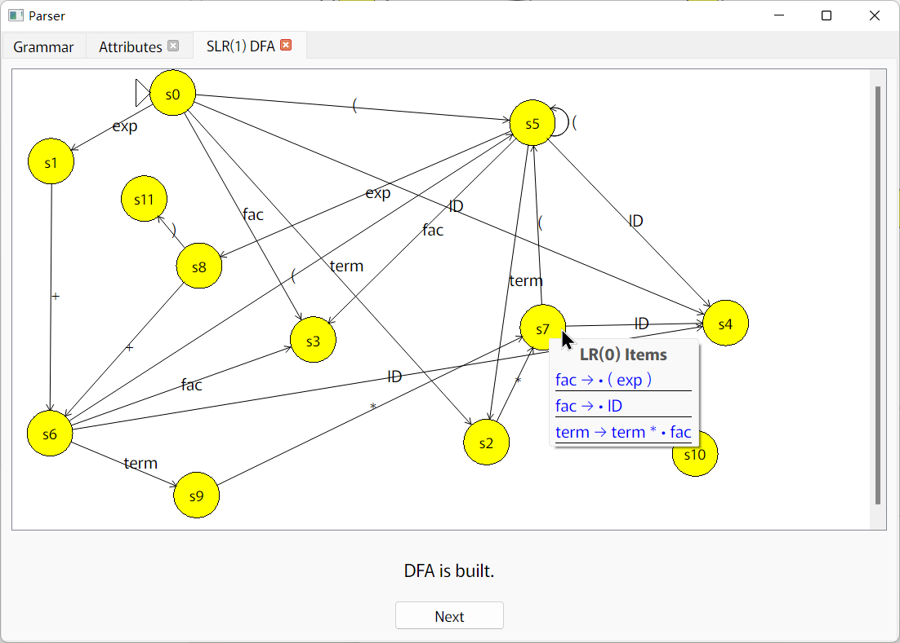
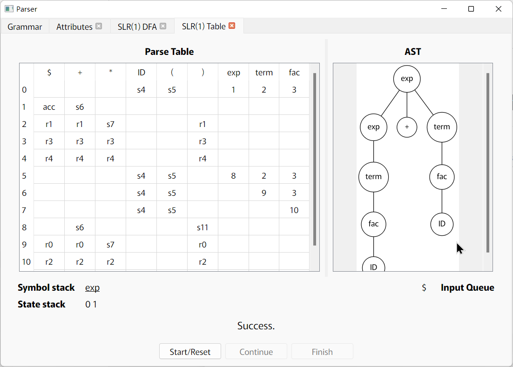

# LRParser

This is a grammar parser which can read grammar files in our format, analyze attributes (nullable, first set, and follow set) of symbols, generate push-down automatons and parse tables. It aims at learning/teaching LR parsing algorithms and does not have the functionalities to actually translate languages to intermediate code.

# CLI

For grammar (stored in `grammar.txt`):

```txt
exp   -> exp + term  | term
term  -> term * fac  | fac
fac   -> ID
fac   -> ( exp )
```

and input (stored in `input.txt`):

```txt
ID * ID * ( ID + ID ) + ID $
```

the possible output is:

```txt
FolderName> build\lrparser.exe -g grammar.txt < input.txt
> Grammar rules has been parsed
Symbols:
    0) ε [TERM]
    1) $ [TERM]
    2) exp [NONTERM,START]
    3) + [TERM]
    4) term [NONTERM]
    5) * [TERM]
    6) fac [NONTERM]
    7) ID [TERM]
    8) ( [TERM]
    9) ) [TERM]
Productions:
    0) exp -> exp + term
    1) exp -> term
    2) term -> term * fac
    3) term -> fac
    4) fac -> ID
    5) fac -> ( exp )
> Calculate symbol attributes
      Name   Nullable              First{}         Follow{}
  --------   --------             --------         --------
       exp      false             { ID ( }        { $ + ) }
      term      false             { ID ( }      { $ + * ) }
       fac      false             { ID ( }      { $ + * ) }
> NFA is built
> DFA is built
> Parse table
  States                        Actions                                            Gotos
--------                       --------                                         --------
         |       $ |       + |       * |      ID |       ( |       ) |   exp |  term |   fac
       0 |         |         |         |      s4 |      s5 |         |     1 |     2 |     3
       1 |     acc |      s7 |         |         |         |         |       |       |
       2 |      r1 |      r1 |     s10 |         |         |      r1 |       |       |
       3 |      r3 |      r3 |      r3 |         |         |      r3 |       |       |
       4 |      r4 |      r4 |      r4 |         |         |      r4 |       |       |
       5 |         |         |         |      s4 |      s5 |         |     6 |     2 |     3
       6 |         |      s7 |         |         |         |      s8 |       |       |
       7 |         |         |         |      s4 |      s5 |         |       |     9 |     3
       8 |      r5 |      r5 |      r5 |         |         |      r5 |       |       |
       9 |      r0 |      r0 |     s10 |         |         |      r0 |       |       |
      10 |         |         |         |      s4 |      s5 |         |       |       |    11
      11 |      r2 |      r2 |      r2 |         |         |      r2 |       |       |
> Summary: 12 states, 0 table cell conflicts.
> Please input symbols for test (Use '$' to end the input)
> Parser states
State stack : Bottom->| 0
Symbol stack: Bottom->|
Input queue : Front ->| ID,*,ID,*,(,ID,+,ID,),+,ID,$
[VERBOSE] Apply SHIFT rule
> Parser states
State stack : Bottom->| 0,4
Symbol stack: Bottom->| ID
Input queue : Front ->| *,ID,*,(,ID,+,ID,),+,ID,$
[VERBOSE] Apply REDUCE by production: 4
> Parser states
State stack : Bottom->| 0
Symbol stack: Bottom->|
Input queue : Front ->| fac,*,ID,*,(,ID,+,ID,),+,ID,$
[VERBOSE] Apply GOTO rule
> Parser states
State stack : Bottom->| 0,3
Symbol stack: Bottom->| fac
Input queue : Front ->| *,ID,*,(,ID,+,ID,),+,ID,$
[VERBOSE] Apply REDUCE by production: 3
> Parser states
State stack : Bottom->| 0
Symbol stack: Bottom->|
Input queue : Front ->| term,*,ID,*,(,ID,+,ID,),+,ID,$
[VERBOSE] Apply GOTO rule
> Parser states
State stack : Bottom->| 0,2
Symbol stack: Bottom->| term
Input queue : Front ->| *,ID,*,(,ID,+,ID,),+,ID,$
...
[VERBOSE] Apply GOTO rule
> Parser states
State stack : Bottom->| 0,1,7,9
Symbol stack: Bottom->| exp,+,term
Input queue : Front ->| $
[VERBOSE] Apply REDUCE by production: 0
> Parser states
State stack : Bottom->| 0
Symbol stack: Bottom->|
Input queue : Front ->| exp,$
[VERBOSE] Apply GOTO rule
> Parser states
State stack : Bottom->| 0,1
Symbol stack: Bottom->| exp
Input queue : Front ->| $
> Success
```

Automatons in graphviz language format are generated in the result directory (default: `.`) because they are difficult to display in the console. You need to invoke `dot` by yourself. The program used to provide generated `svg` files as well if you have `dot` installed, but invoking dot processes on Windows is too slow (in Linux it's just fast) and makes the tool a target of Windows Defender Anti-virus module because the tool invokes a lot of processes in such a short time. Later I tried to use graphviz as library in my code, but I have double free() bugs which I couldn't get right. So I dropped the support for directly generated svg files.

SLR NFA:



SLR DFA:



## Usage

```txt
This program reads a possibly LR grammar from <Grammar file>, takes test
sequence from standard input stream, and stores analysis results into
<Result Dir>.

Usage: lrparser -h|--help
       lrparser [-t<Type>] [-g<Grammar file>] [-o<Result Dir>]] <FLAGS>

Possible command: lrparser -tslr -g grammar.txt -o results

Grammar file:
  1) Use % to start a line comment.
  2) \e, _e, and \epsilon are reserved for epsilon.
  3) | is reserved for separating multiple bodies of a production.
  4) You shouldn't use token $ in grammar file.
  5) Define productions as the following example shows. All symbols at the left
     hand side of productions are automatically defined as non-terminals. The
     first non-terminal symbol is defined as the start symbol. While symbols in
     the same production body should be kept in the same line, multiple bodies
     can be written in consecutive lines or be separated in different
     productions (as the definition of "fac" shows below).

     exp   -> exp + term  | term
     term  -> term * fac
            | fac
     fac   -> ID
     fac   -> ( exp )

  6) Strict mode: In this mode, token naming is based on C-style variable
     naming. Besides, \ can appear at the first character of token, and quoted
     symbols are supported. " and ' can be used to quote a symbol, e.g. '+'. "'"
     and '"' are okay, but you may not use them both in one symbol. Spaces in a
     quoted string are not allowed. This mode can be turned on using argument
     `--strict`. In most cases, this mode is not necessary.

Options:
  -t        : Choose a parser type. Available: lr0, slr (default), lalr, lr1.
  -o        : Specify output directory. (Default: ".").
  -g        : Specify grammar file path. (Default: "grammar.txt")
  -h|--help : Output help message and then exit.

Flags:
--no-test : Just generate automatons and parse table. Do not test an input
            sequence. Program will finish as soon as the table is generated.
--no-label: Only show index of each node in dumping results.
--sep=str : Define the start of a production as the given <str>. The default
            is "->", but you may want "::=" or ":" if your grammar is written
            that way. This might be helpful if you are comparing several
            different grammar parsing tools.
--strict  : This option applies to both the grammar and input sequence. See
            grammar introduction above.
--debug   : Set output level to DEBUG. Not helpful if you are not developing.
--step    : Read <stdin> step by step. If you have to process a very large input
            file, you may need this flag. But without this flag the parser can
            provide better display for input queue (by read all input into
            memory).
```

The grammar is not compatible with Bison's. It's because Bison has a semicolon after each definition, while we just start a new line. If you want to edit a grammar file in Bison format to adapt our grammar format, you can:

   1. Remove semicolons. (You do not have to remove token definitions, because we've made `%` a comment-starting token.)
   2. Make sure all symbols in the same production body stay in the same line.
   3. Pass argument `--sep=":"` when launching the program. This argument makes the tool search for `:` instead of `->`. (Similarly, if you have production whose format is like `A ::= B a`, you can use `--sep="::="`.)
   4. Move at least one production of the start token to the beginning of the rules.
   5. Remove comments and code blocks (syntax-directed translation is not supported by this tool).
   6. Replace epsilons with `\e`.
   7. Pass argument `--strict` to enable limited quoting support.

I provide a script named `run.sh` for format conversion. It provides an easier way to pass arguments as well. The function is minimal. If you want to change the grammar type, you can edit the script directly.

# GUI

Following packages are required:
- graphviz
- PyQt5

And Graphviz should be installed so `dot` command appears in `PATH`. 

After building (see next section), run the program with:

```cmd
.\env.cmd
python3 .\src\gui\main.py
```
or 
```bash
export PATH=build:$PATH
python3 ./src/gui/main.py
```

Some screenshots:







**Only LR family is implemented.**



Those nodes can be dragged. States' descriptions pop up when mouse is hovering on them. 



# Build

```bash
git clone git@github.com:Simouse/lrparser.git
cd lrparser
mkdir build && cd build
cmake -G Ninja .. # Or "cmake .." if you do not have Ninja
cmake --build .
```

# Resources

I found some resources really helpful in my learning. I compared my results with their programs' to detect my bugs and the reasons causing them. I didn't use their code though.

[jsmachines](http://jsmachines.sourceforge.net/machines/) supports ll1/lr1/lalr/slr/turing, etc. It's lightweight and fast.

[Context Free Grammar Tool (ucalgary.ca)](http://smlweb.cpsc.ucalgary.ca/start.html) is a website providing colorful parse tables for grammars. It does not support very long grammar due to the length limit of URL.

[SilverScar/C-Language-Parser](https://github.com/SilverScar/C-Language-Parser) provides a C89 grammar in yacc.

# Questio

## How to show `ε` correctly in console?

On Windows, you can use `chcp 65001` to enable `UTF-8` in `cmd.exe,` and use `[Console]::OutputEncoding = [System.Text.Encoding]::UTF8` in `PowerShell`. On macOS and Linux platforms, this normally shouldn't be a problem.

## `#include <vcruntime.h>` causes compilation error.

Just remove those lines. My editor added those for me, but they are not needed. I often forget to delete those lines...

## For large inputs

This tool is not a suitable choice for extremely large inputs, for the result can not be easily observed. If you still want to use it against large inputs, continue reading.

For very large test sequences, you can use `--step` flag to disable memory cache of all input characters (, which is normally unnecessary given the purpose of this tool). 

For very large grammars, the result is almost impossible to observe. I tested my tool against C89 grammar, and found hundreds of DFA states had been generated. Chances are that `dot` will freeze when you try to visualize the graph. 

As for performance, for C89 grammar (You can find it with the url stored in `c89.url.txt` and use run.sh to convert the file format) on my Windows machine, it takes the LR(1) parser about 1.5 seconds to finish (when stdout is piped to null). This is because the program generates gv files and a step file, along with stdout. Although you can redirect the output to `/dev/null` (In ` cmd.exe` on Windows, use `> nul` instead), these strings are still calculated, so it is still slow. Besides, all sets used in the program are based on bitset, which is less efficient when set is sparse and large. The tool assumes grammars to be small because a large grammar is difficult to analyze and study. However, if you intend to test the performance, well, a large grammar should be used. I thought I made a mistake here, cause optimizing for small grammars whose analysis was fast enough seemed pointless. Later I tried `std::set` and `set::unordered_set`, but the results were not ideal, either. Compared with the LR(1) parser, other parsers are much faster. (~0.1 s for SLR(1) parser of C89 grammar; ~0.2 s for LALR(1) parser of C89 grammar)

## Why does your program detect conflicts in C language (ANSI-89) ?

You probably used one of yacc files online and test it with `bison`. Those yacc files define extra rules to gain conflict resolutions, so they are not pure LR. After removing those rules, `bison` will find conflicts as well.
